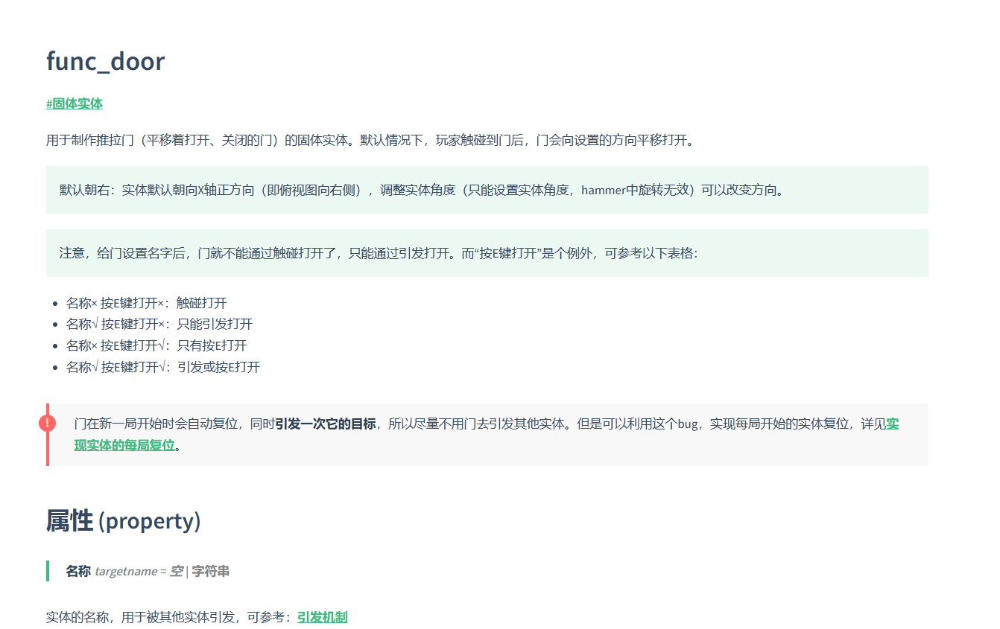

# 彩笔制图宝典：CS1.6地图制作/Hammer3.5 教程与百科

- 此项目原地址为：https://github.com/AllocBlock/CS1.6-mapper-guide，原作者弃坑较久，现在我Lws改为KZ地图制作教程

- 欢迎加入QQ群 [彩笔的逆袭 群号：15876347](https://jq.qq.com/?_wv=1027&k=e6eqbt1u) 一起玩耍！

## 环境配置
- 因为Docsify是动态加载Markdown文件并解析的，它需要挂载到服务器上才能工作，**不能直接双击打开index.html**
  - 你可以使用VS Code的Live server插件，一键即可搭建本地服务器
  - 或者按照[Docsify文档](https://docsify.js.org/#/zh-cn/quickstart)的步骤配置环境，然后使用docsify serve docs搭建本地服务器
  - 你可以自己搭建本地服务器，比如通过phpStudy软件

## 成果展示

